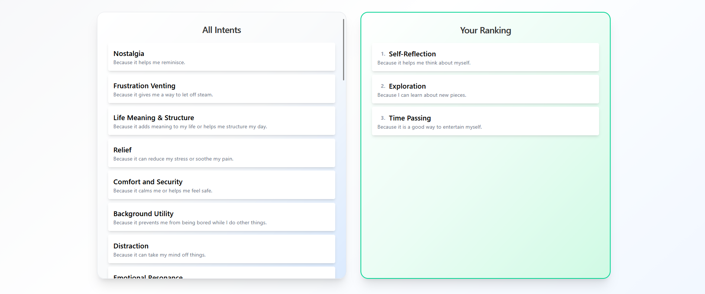
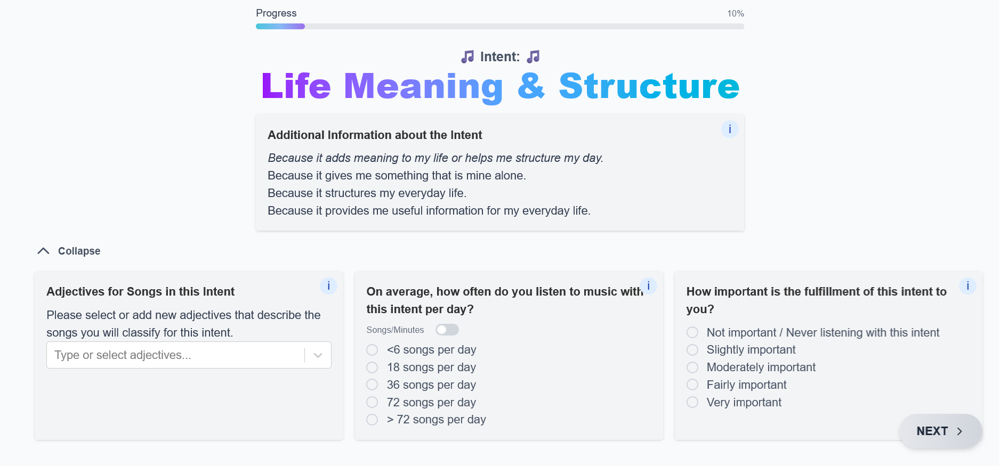
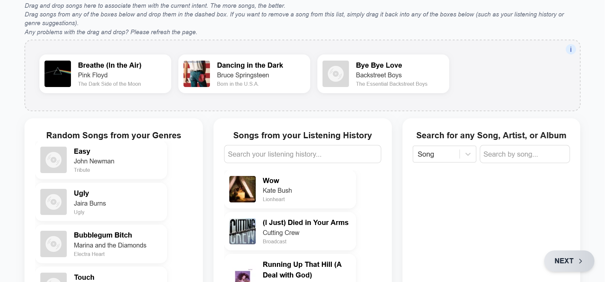

# Music Listening Intents - Study Platform

A web application built to collect the data for a bachelor's thesis on why people listen to music and how this shapes the music they choose. It was used by 121 participants recruited via Prolific.

A **listening intent** is the underlying reason or goal a listener has when listening to music, such as gaining energy in the morning, supporting concentration during the day or winding down in the evening. The study uses a set of 33 such intents.

## Research questions

The data collected with this platform was analysed in a thesis to answer:

1. Do demographics influence the importance, listening frequency and selection of intents in music listening?
2. How different are the intents described by the participants and do similar patterns emerge within intents?
3. Are different genres preferred in various intents and how similar are the intents in terms of their genre selections?

## Participant flow

| Step | Description |
|---|---|
| Consent | Information about the study and data handling |
| Prolific ID | Used to identify participants internally |
| Background | Age, gender, nationality, genres, musical experience and daily listening time |
| Ranking | All 33 intents are shown, participants select and rank their top 10 |
| Per intent | Adjectives describing the music, listening frequency, importance and at least five songs |

The last step is repeated for each of the 10 selected intents. Songs can be chosen from a catalogue, from the participant's own Last.fm listening history, or entered manually.





## Stack

- Next.js 16 (App Router), React 19, TypeScript
- PostgreSQL via Sequelize
- Tailwind CSS
- Last.fm API for listening history and song search
- Docker Compose for local deployment

## Running it

Requires Docker. Create a .env file in the project root with the following variables:

| Variable | Purpose |
|---|---|
| `POSTGRESQL_URI` | Postgres connection string |
| `POSTGRES_PASSWORD` | Password for the Postgres container |
| `NEXT_PUBLIC_LASTFM_API_KEY` | Last.fm API key |
| `NEXT_PUBLIC_LASTFM_API_SECRET` | Last.fm API secret |
| `NEXT_PUBLIC_BASE_URL` | Base URL, e.g. `http://localhost:3000` |

Then start the app:

```bash
docker compose up
```

## Known limitations

Noted here rather than left out. The schema is created and updated by `sequelize.sync({ alter: true })` at startup instead of through migrations, which works for a single-purpose study but not for anything longer-lived. The Last.fm key is read via a `NEXT_PUBLIC_` variable and therefore ends up in the browser bundle, where it should be proxied through an API route instead.

## Context

Built for *Individual Differences in Music Listening Intents: A Participatory Study of Selection, Description, and Genre* (BSc Artificial Intelligence, Johannes Kepler University Linz, 2026).